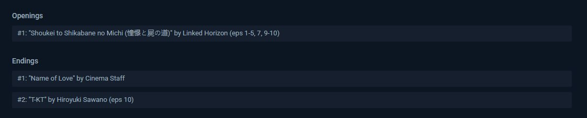

# 🚀 AniList Ultimate - Roadmap & TODO

**Last Updated:** 2026-04-29
**Current Status:** Phase 6 (UI/UX Refinement) 🟢

---

## 🏗️ P6 - UI/UX REFINEMENT (IN PROGRESS)

*Focus: Polishing the interface, fixing layout regressions, and improving transitions.*

### Astra Dashboard & Core UI

- [X] **BUG-020: Resize Handler** - Ensure extension elements (Astra, Tooltips) don't break when resizing the window.
- [X] **Astra Navigation** - Implement macro-categories (Reading, Completed, All, etc.) as dropdowns or tabs instead of just tags.
- [X] **Sticky Search** - Make the search bar in Astra sticky so it stays visible during scroll.
- [ ] **Closing Animation** - Add a smooth "outro" animation when closing the Astra dashboard.
- [X] **Alignment Fix** - Correct decentered items above the votes/scores section.
- [X] **Icon Loading** - Switched to Font Awesome SVG/JS to fix CSP font-blocking issues.

### Page Enhancements (Media & User)

- [X] **Media Page Stability** - Fix social activity bubbles, comments, and filters on individual anime/manga pages (currently broken).
- [ ] **User Activity Enhancements** - Add votes and filters to the single user activity feed.
- [ ] **Banner Action** - Add a "+" button near the "Follow" button in user banners to quickly add/remove from custom lists.
- [ ] **Follower Stats** - Add follower/following counters to relevant profile sections.
- [X] **Missing UI Elements** - Restored the "pill" buttons in the media page sidebar "In Progress" section.

### Visual & Assets

- [X] **BUG-021: Comment Icon** - Replace low-res SVG with high-quality version and fix hover trigger area.
- [X] **BUG-025: Weight Position** - Move the Global Weight indicator to the left in Astra rows.
- [X] **COS-002: Calendar Redesign** - Rework the graphics for social activity within the calendar cards.

---

## 🛠️ P7 - DEBUG & ERRORS

- [ ] **Runtime Fix** - `TypeError: Cannot read properties of undefined (reading 'init')` at `settings#au-custom-lists`.
- [ ] **BUG-034: Logging System** - Fix `src/core/logger.ts` so logs actually appear in the console.
- [X] **API Resilience** - Ensure cached data (Reviews, Calendar) is shown if API is down. [DONE]
- [ ] **Astra Bug Hunt** - Systematic testing of internal Astra logic to catch edge-case crashes.

---

## ✨ P8 - NEW FEATURES & INTEGRATIONS

- [X] **Media Metadata** - Add MAL score, MAL link, and Subreddit link to media pages (with caching and native styling). [DONE]

- [ ] **Music Integration** - Show Opening/Ending titles with direct YouTube search links.
- [ ] **Progress Notes** - Show/edit notes immediately when incrementing episode/chapter progress, bastaerebbe anche il campo delle quick note nell avviso che appare, la stessa notifica delgi errori ecc.
- [ ] **Offline Astra** - Research keeping Astra functional (read-only) even without an active API connection.

---

## 🧹 P9 - STABILITY & REFACTORING

- [X] **Social Activity Stabilization** - Restricted social bubbles to home page and ensured cleanup on navigation. [DONE]
- [X] **Home Page Social Bubbles** - Implemented calendar-style floating portals for all home page native cards. [DONE]

  - [!] *Known Bug*: Sometimes bubbles persist on screen (will address later).
- [X] **Brand Cleanup** - Removed legacy "v2" CSS classes, updated project descriptions/logs, and cleaned up storage keys. [DONE]
- [X] **Status Enums** - Replaced hardcoded strings for "Reading", "Watching", "Plan" with a centralized TypeScript Enum for better type safety. [DONE]
- [ ] **Review Caching** - Verify if the main `/reviews` page needs the same caching logic as the homepage.
- [ ] attenzione che il calendario c è ed ok, ma a votla compare anche la sezione airing, ovvero la duplicaizone del calendairo

ci sono tutte le cose fuori da astra da applicare, tipo che i filtri nelle activity devono tornare su All a ogni cambio di pagina

da reinserire il bottone capusle in anime e manga in progress, controllare se manca qualche direttiva @inject ad esempio. In home

i cidimaine di commenti si sono spostati ancora leggermente sulla destra dentro le loro righe

I fgiltri non funzionano bene, se ne fregano di read, completed ecc, specialmente dentro le poagine delle opere, e quindi forse se implementato anche in quello nella home nelle pagine degli utenti. Questa funzionalità ad esempio deve essere disponibile anche senza anilist API. Come tutte le cose già cachetate, inutile perderle

Cancellare il + nella sezione anime e amnga in progress solo se le API sono disponibili, altrimenti non possiamo creare il bottone pillola, o sì?

funzionalità

- [ ] Un modo per mettere le Lodi? (+1 voto massimo?))

  [ ]  Astra dashboard: implementare una ricerca multipla, con più liste ad esempio? non so, ci penserò

  **[ ]  Astra dashboard: Bulk Editor** - Create a tool for bulk editing items within custom lists.

  Ovviametne quando si clicca il + su anilist, deve aggiornarsi anche l entry su astra dashoboard, stessa cosa vale per ogni volta che su anilist la entry subisce modifiche

  una funzione che permette di unire i commenti scritti dentro le note di astra, quelle nei singoli episodi, e fare append al commenton originale di anilist

  Grafica
- [ ] Togliere quel pallino fastidioso che fa da stanghetta alla A nel logo Astra
- [ ] Astra settings: Lo slider va oltre la rating sections, che scrolla sopra oltre il massimo previsto
- [ ] astra settings: I 6 pallini ceh sembrano quelli con cui si attiva il drag and drop sulle sezioni dei voti Non funzionano
- [ ] Astra settings: Rework al bottone save changes per matahcare quello del quick edit?
- [ ] astra dashboard, aprire sì su all, ma solo con watching come sezione estesa, gli altri dropdown chisui, almeno non carica tanto e stuttera
- [ ] astra dashboard, stessa cosa col sync e toggle progress, da reworkare?
- [ ] astra dashboard: wrapped da finire, ho scaricato le cose fatte con opus per avere lo sfondo fluidop, da integrare nel progetto
- [ ] astra dashbard: majopr rework da fare alle stats, pensre come
- [ ] astra dashboard: le freccette degli slider sono sempre attiva, anche quando i rispettivi slider non ci sono perchè non servono. è corretto così?
- [ ] astra quick edit: se clicchi dentro rating notes si illumina in maniera strana, edit veloce da fare
- [ ] astra quick edit: episode journal, serve un leggero padding alla fine, l ultimo episodio si scontra con il bordo

---

## 📋 CURRENT WORK & PLANS

- [Plan: Social Activity Module Refinement](file:///C:/Users/ricca/.gemini/antigravity/brain/dd7e044c-453b-4dcf-a6ab-189b6a43b3c4/implementation_plan.md)

- [X] **Comment Caching** - Persistent storage for user notes/comments. [DONE]

---

## ✅ ARCHIVE (COMPLETED)

<b>Click to view completed Milestones (P1 - P5)</b>

### P5 - Data Consistency & Astra Stability

- ✅ **BUG-008**: Calendar social avatars always show.
- ✅ **BUG-009**: Astra dashboard initialization race condition fix.
- ✅ **BUG-031**: Works index map sync.
- ✅ **ARCH-003**: Vue.js Router interference prevention (`stopPropagation`).
- ✅ **UI-001**: Layout shift fix (inset box-shadow + scrollbar-gutter).

### P4 - Type Safety

- ✅ **BUG-014/16/17**: Removed `any` from EventBus, Config, and AstraModule.
- ✅ **API Transparency**: Detailed GQL error extraction and 429 Toast warnings.

### P3 - Performance

- ✅ **BUG-007**: SharedGlobalObserver implementation.
- ✅ **BUG-010**: Local Font Awesome bundle.
- ✅ **BUG-011**: Manifest CSS bundling.

### P2 - High Impact

- ✅ **BUG-003/006**: Notification merge/unmerge logic.
- ✅ **BUG-028**: API spam reduction in SocialService.
- ✅ **BUG-033**: Comment cache corruption fix.

### P1 & Caching

- ✅ **Security**: GraphQL injection prevention in SocialService.
- ✅ **Smart Caching**: Implemented fingerprint-based invalidation for Activities, Reviews, Calendar, and Notifications.

<b>Recently Finished UI Tasks (P6)</b>

- ✅ **BUG-018**: Dropdown arrow repetition fix.
- ✅ **BUG-026**: Progress bar color darkened.
- ✅ **BUG-027**: Row width set to 100%.
- ✅ **COS-001**: Title Case for "All Statuses".
- ✅ **COS-003**: Bouncy pop-up animation for Astra.
- ✅ **COS-005**: Default filters set to "All".
- ✅ **Astra Search**: Fixed sticky positioning.
- ✅ **BUG-020**: Resize Handler (Tooltips & Dashboard).
- ✅ **Astra Layout**: Scrollbar-gutter stability.
- ✅ **Astra Navigation**: Macro-categories & Grouped view.

---
