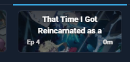

# 🚀 Astra Ultimate - Project Roadmap & TODO

---

## ✅ Enterprise Refactoring (COMPLETED)

- [X] **Atomic Storage & Lazy Loading**: Split monolithic JSON into manifest + media keys.
- [X] **Performance Optimization**: Fixed "Rerender Suicide" in AnimeCards and grid.
- [X] **API Decoupling**: Implemented `SyncQueueService` for background, non-blocking AniList sync.
- [X] **Infrastructure Cleanup**: Removed all "v2", "legacy", and migration debt.
- [X] **Smart Journal Sync**: Replaces existing Astra notes instead of appending duplicates.

---

## 🏗️ Debito Architetturale (Code Review 2026-06-12)

### ✅ Risolti in questa review
- [X] **Sicurezza**: GraphQL injection (GraphQLBatcher `$`-passthrough + HoverComments), XSS (AstraRadarChart nomi sezione, CustomListManager search), `clearQueue` promise appese, race cold-start MV3 (background.ts), `factoryReset` scan storage rotto.
- [X] **SyncQueueService race**: mutex async (`withLock`) serializza enqueue/process nel contesto.
- [X] **Performance**: sync AniList O(n²)→O(n) (`skipPersist` + persist unico).
- [X] **Memory leak**: listener `document` gestiti in AstraStatusSelector/AstraScoreForm.
- [X] **Dead code**: rimossi CustomScrollbar, AstraWorkGrid, AstraStatsOverview.
- [X] **Immutabilità**: `AstraRepository.getSections/getSettings` ritornano copie.
- [X] **Style**: `console.log`→`log.debug` (AstraUIBridge, AstraNavigationService, AstraEnhancementService).
- [X] **DI duplicata**: rimossa doppia registrazione Astra in `setup.ts`.

### ✅ Refactor strutturali (COMPLETATI 2026-06-13)
- [X] **Test coverage (PRIORITÀ 0)** — fondazione core posata: 15 file, 110 test verdi. Store, GraphQLBatcher, SyncQueueService, AstraRepository, AnilistClient, LRUCacheWithTTL, AstraCalculator, AstraFilterService, Sanitizer, EventBus, NavigationService, CalendarDataService, Template, AstraParserService, AstraSyncService.
  - Rimosso dead code Sanitizer (sanitize/formatMultiline); bug reale trovato+fixato in EventBus (throw sincrono dei listener).
- [X] **Unificare i 3 pattern di store**: `core/state/Store`, `AstraDashboardStore`, `CalendarStore` → base reattiva comune con `subscribe()` override e `computeView()` pattern.
- [X] **Consolidare push-to-notes**: `AstraRatingService.saveAndSync()` ora inietta direttamente `IAstraParser`, elimina `container.resolve()`. Politiche differenti documentate.
- [X] **SyncQueue cross-context**: race read-modify-write risolto con "reconcile by id" pattern — re-legge la coda a fine `process()` per mergerae removals/updates vs stato concorrente.
- [X] **`destroy()` cleanup** (ThemeManager, CommentTooltip, SocialSidebar, CustomListModule): listener globali gestiti su mount/destroy con handler named + removeEventListener.

### ✅ Refactor secondari (COMPLETATI 2026-06-13)
- [X] **`IConfigManager` duplicata**: era già stata unificata in una sessione precedente (solo `core/interfaces/IConfigManager.ts` la definisce).
- [X] **Service-locator → Constructor Injection (AnimeCard)**: `CalendarService`, `SocialRenderer` e `AstraRatingController` ora iniettati via constructor (con `delay()` per evitare import circolari) invece di `container.resolve()` nei getter. 110/110 test verdi, tsc pulito.

### ⏸️ Lasciati intenzionalmente (rischio > beneficio a questo punto)
- [ ] **`AstraModule.resolveDependencies()`**: lazy-resolve esplicitamente documentato per rompere pattern circolari nel lifecycle del ModuleRegistry, incluso un `try/catch` di degradazione graceful per `AstraDashboard`. Convertirlo a constructor injection rimuoverebbe quella rete di sicurezza proprio prima del test manuale — stessa categoria di rischio della decisione già presa sul god-facade.
- [ ] **`AstraService` god-facade**: ~30 metodi pass-through verso il repository. **Nota**: già valutato; ritenuto un Facade pattern intenzionale, non splittato.

### 🟢 Minori
- [ ] `settings.ts:231`: `error.message` in `innerHTML` senza escape (schermata di errore).
- [ ] `ActivityRenderer`: URL avatar/cover interpolati non-escaped in `url()` CSS (basso rischio, URL CDN AniList).
- [ ] `AnilistClient`: heuristic `data !== undefined` per raw/non-raw → usare il flag `isRaw` come unica fonte.

---

## 📊 Astra Dashboard

*Il centro di controllo dell'esperienza Astra.*

- [X] **Infrastruttura Caching**: Sistema centralizzato O(1) completato.
- [ ] **Virtual Scrolling**: Implementare il rendering a finestre (Windowing) per eliminare il lag della Dashboard con 1000+ entry.
- [ ] **Sorting Avanzato**: Implementare nel `AstraFilterService` il sorting reale per `Completed Date`, `Data di modifica`, `Start`, ecc. (Logica pronta, serve UI binding).
- [ ] **Astra Wrapped**: Integrare lo sfondo fluido (Opus) per il recap stagionale.
- [ ] **Dynamic UI (Scrolling)**: Header collassabile durante lo scroll della grid per massimizzare lo spazio.
- [ ] **Bulk Editor**: Strumento per editing massivo di tag e liste personalizzate.

## 📓 Astra Ratings & Journal

*Sistema di annotazione e valutazione avanzata.*

- [ ] **Multi-Format Support**: Verificare piena compatibilità del Journal per Manga (Chapters) e Novel (Volumes).
- [ ] **Optional Comments**: Opzione nelle impostazioni per disabilitare il sync automatico dei commenti su AniList.
- [ ] **Sistema Lodi**: Implementare un sistema per assegnare "lodi" o premi speciali a opere eccezionali.

## 🛠️ Fixes & UX Improvements

- [ ] **Riprogettazione Flussi Iniezione**: Studiare tutte le combinazioni (Calendar ON/OFF, Astra ON/OFF) per decidere il comportamento ideale della Pillola/Capsula in ogni scenario (Home, Liste, Calendar).
- [ ] **Fix Astra Dashboard**: Risolvere il blocco totale della dashboard (probabile conflitto DI o Storage).
- [ ] **Slider Arrows Bug**: Le freccette degli slider rimangono visibili anche senza contenuto.
- [ ] **QuickEdit Cleanup**: Risolvere immagine sfocata e bug del "doppio hover".
- [ ] **Modal UX**: Verificare che il tasto "Save" chiuda sempre la modale dopo aver accodato la richiesta.
- [ ] **Theme Adaptation**: Audit finale per compatibilità con i temi Dark/Contrast di AniList.
- [ ] **SharedGlobalObserver Audit**: Verificare l'impatto prestazionale dello scansionamento globale rispetto a MutationObservers mirati.

## 📈 Project Management

- [ ] **Setup Git Pubblico**: Configurare il repository ufficiale e archiviare i vecchi branch sperimentali.

manca il l animazione di outro

nel quick edit manca il tasto A girato per andare nella dashboard [FATTO]

muovere il toggle finale dentro il campo piuttosto che a destra di override

nel jounral i campi delle note fanno acnora il cazzo che vogliono

cambiare la X col comportamento default, se clicchi fuoris i chiude, autosave [FATTO]

non diventa rossa e il counter non riparte, per farlo bisogna refreshare la pagina

rimuovere nella apgina degli anime la parte di query sui following, fare in modo che le cusotm lists funzionino anche qua, stessa cosa per i voti, e sistemare i commenti che sono completmante fuckuppati

sempre qua, se cliccho sul bottone sotto la cover, non c è lo stile personalizzato come era prima, ma apre comunque la finestra corretta (CHE PERÒ NON SI CHIUDE SE CLICCO FUORI!). quindi andare a cercare per eventuale codice morto

quando ho cliccato nella pagina di un personaggio: 
Error in Anilist API
Not Found.
Perchè l ha fatto? Quelle apgine devono essere escluse da ogni tipo di chiamata