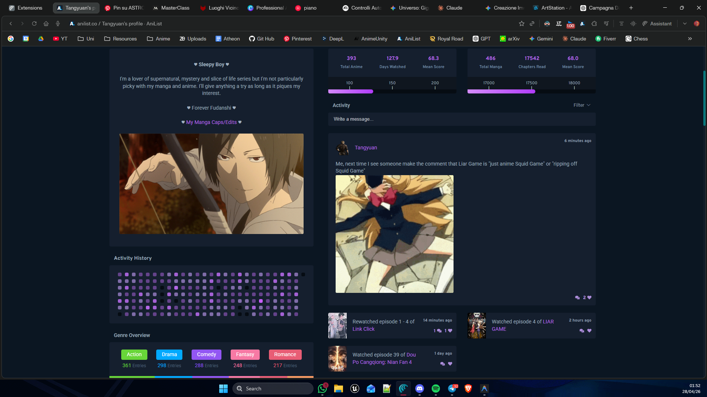
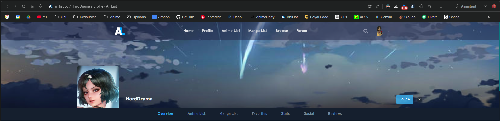

# AniList Ultimate v2 - TODO List

**Last Updated:** 2026-04-28
**Status:** P5 Complete ✅ (Data Consistency & Astra Stability Milestone)

---

## ✅ P1 - CRITICAL SECURITY (COMPLETE)

### ~~BUG-029: GraphQL Injection in SocialService~~ ✅

- **Status:** FIXED in commit `c20eb67`
- **File:** `src/modules/social/SocialService.ts:87`
- **Fix Applied:** Uses GraphQL typed variables (`$m${idx}: Int!`) instead of direct interpolation
- **Impact:** Prevents GraphQL injection attacks

---

## ✅ SISTEMA DI CACHING INTELLIGENTE (COMPLETE)

### Obiettivo ✅

Implementare caching con **fingerprint-based invalidation** invece di solo TTL - COMPLETATO!

### Implementazione Completa

#### 1. ✅ Fix scoreCache Memory Leak (ActivityService)

- **File:** `src/modules/activity/ActivityService.ts`
- **Implemented:**
  - LRU cache (max 100 entries)
  - TTL 5 minuti
  - getCachedScore/setCachedScore wrappers
  - clearCache() method

#### 2. ✅ Intelligent Review Caching

- **Files:** `src/modules/reviews/ReviewService.ts`, `ReviewEnhancerModule.ts`
- **Implemented:**
  - LRU cache (max 200 entries) + TTL 30min in ReviewService
  - Fingerprint-based batch deduplication in ReviewEnhancerModule
  - Confronta sorted review IDs prima di fetch
  - Skip API call se fingerprint uguale (homepage 4 reviews)

#### 3. ✅ Intelligent Calendar Caching

- **Files:** `src/modules/calendar/CalendarStore.ts`, `CalendarDataService.ts`
- **Implemented:**
  - Cache persistente in chrome.storage.local (TTL 30min)
  - Fingerprint FNV-1a hash da mediaId + airingAt
  - loadEntriesFromCache() con TTL validation
  - Auto-invalidazione su progress update
  - forceRefresh parameter in loadSchedule()

#### 4. ✅ Intelligent Notification Caching

- **File:** `src/modules/notifications/services/NotificationFetchService.ts`
- **Implemented:**
  - Cache persistente in `chrome.storage.local` (TTL 30 giorni)
  - LRU cache aumentata a **1000 voci** per coprire lo storico completo
  - Persistenza dei dettagli attività tra le sessioni
  - Rimosso reset su navigazione SPA (performance istantanea)
  - Ottimizzato per merge/unmerge toggle con validazione ID

#### 5. ✅ Manual Cache Invalidation

- **Status:** Methods implemented in all services
- **Available:**
  - ActivityService.clearCache()
  - ReviewService.clearCache()
  - CalendarStore.invalidateCache()
  - NotificationFetchService.clearCache()
  - SocialService.invalidateFollowingsCache()
  - SocialService.clearAllCaches()
- **TODO:** Expose in UI (settings panel) - P6 UI task

#### 6. ✅ Followings Cache Improvements

- **File:** `src/modules/social/SocialService.ts`
- **Implemented:**
  - refreshFollowings() method (force refresh)
  - invalidateFollowingsCache() method
  - clearAllCaches() for full reset
- **TODO:** Add button in settings UI - P6 UI task

---

## ✅ P3 - PERFORMANCE (COMPLETE)

- **Status:** FIXED all 5 performance bottlenecks.
- **Milestone:** Implementation of SharedGlobalObserver (BUG-007).

### BUG-007: MutationObserver Optimization ✅

- **Implemented:**
  1. Shared single observer pattern via `SharedGlobalObserver.ts`
  2. Target containers (`.notifications`, `.activity-feed`) instead of document.body
  3. Optimized `BaseModule.registerObserver` to support specific targets

### BUG-010: Font Awesome Local Bundle ✅

- **Status:** FIXED - local import of `@fortawesome/fontawesome-free`

### BUG-011: Manifest CSS Bundling ✅

- **Status:** FIXED - all module CSS files added to `manifest.json`

### BUG-012: CalendarStore DI Pattern ✅

- **Status:** FIXED - resolved via container in `AstraModule`

### BUG-013: Proxy Singleton Race Condition ✅

- **Status:** FIXED - removed proxy pattern in `AnilistClient.ts` (replaced with direct DI)

---

## ✅ P4 - TYPE SAFETY (COMPLETE)

- **Status:** FIXED all type safety leaks and `any` usages in core modules.

### BUG-014: EventBus Generic Fallback ✅

- **Status:** FIXED - removed `[key: string]: any` from `AppEventMap`

### BUG-016: ConfigManager Any Type ✅

- **Status:** FIXED - storage typed as `IStorageService`

### BUG-017: AstraModule Any Types ✅

- **Status:** FIXED - resolved `IApiClient` and `ToastService` with proper types

### API Transparency & Error Handling ✅

- **Status:** FIXED in commit `7a8b9c2`
- **Implemented:**
  - Estrazione dettagliata errori GraphQL (da payload `errors`)
  - Toast di avviso immediato per Rate Limit (429) con countdown 60s
  - Rimozione completa di `any` nella gestione errori API

---

---

## ✅ P5 - DATA CONSISTENCY (COMPLETE)

### ~~BUG-008: Calendar Social Avatar Always Show~~ ✅

- **File:** `src/modules/calendar/`
- **Status:** FIXED - Always shows the social button on calendar cards even if `friendActivity` is empty, ensuring UI consistency and access to the sidebar.

### ~~BUG-009: Astra Dashboard Initialization Race Condition~~ ✅

- **Problem:** Astra dashboard failed to open via direct calendar button click but worked via secondary navigation.
- **Fix:** Centralized the `ASTRA_OPEN` EventBus listener directly in the `AstraDashboard` constructor (singleton). This ensures the component is ready to handle events as soon as it's resolved by DI, independent of the parent `AstraModule` async initialization phase.

### ~~BUG-031: worksByMediaId Index Not Updated~~ ✅

- **File:** `src/modules/astra/AstraService.ts`
- **Status:** FIXED - Rebuilt map index after `syncWithAniList` and properly set reference in `saveWork()`.

### Astra Dashboard Stability ✅

- **Fix:** Added `✅ ARCH-003: DOM Stability (Vue.js Crash Prevention)` - Added `e.stopPropagation()` and `e.preventDefault()` to all critical injected buttons (Astra, Settings) to prevent Vue Router interference.
- **Fix:** `✅ UI-001: Astra Dashboard Layout Shift` - Replaced `border-left` with `box-shadow: inset` and added `scrollbar-gutter: stable` to the modal container.

---

## 🟤 P6 - UI/UX (6h effort)

### BUG-018: All Statuses Dropdown Arrow Repeat

- **Issue:** Arrow indicators repeat infinitely when value selected
- **Fix:** CSS fix for dropdown arrow

### BUG-019: Custom Lists Rendering

- **Issue:** Malrenduto in activity feed
- **Fix:** Use cloneNode() instead of HTML reconstruction

### BUG-020: Resize Handler

- **Issue:** Extension elements break on window resize
- **Fix:** Add resize event listeners

### BUG-021: Comment Icon Low Resolution

- **Issue:** SVG icon bassa qualità
- **Fix:** Higher quality SVG + fix hover area

### BUG-022: AniList Color Mismatch

- **Issue:** Extension colors don't match user's AniList theme
- **Fix:** Read CSS custom properties from AniList DOM

### BUG-023: Import/Export Labels

- **Issue:** Possibly inverted in Astra
- **Fix:** Verify and swap if needed

### BUG-024: Wrapped Feature

- **Issue:** Annual summary incomplete/broken
- **Fix:** Complete implementation

### BUG-025: Global Weight Position

- **Issue:** Positioned incorrectly in Astra
- **Fix:** Move to left

### BUG-026: Progress Bar Color

- **Issue:** Too bright blue
- **Fix:** Darker shade

### BUG-027: Row Content Width

- **Issue:** Doesn't fill horizontal space
- **Fix:** width: 100%

### COS-001: All Statuses Text

- **Issue:** All caps looks out of place
- **Fix:** Title case

### COS-002: Calendar Social Redesign

- **Goal:** Rework grafico social activity dal calendario

### COS-003: Astra Dashboard Animation

- **Goal:** Opening animation for smoother UX

### COS-004: Color Scheme

- **Suggestion:** Orange instead of teal?

### COS-005: Filter Defaults

- **Goal:** Set "All" as default in all 3 sections

---

## ⚫ P7 - DEBUG TOOLS (Last Priority)

### BUG-034: Logging System Not Working

- **Files:** `src/core/logger.ts`, multiple modules
- **Issue:**
  - DEBUG.ENABLED = true ma nessun log appare
  - console.log() diretti non funzionano
  - Possibili cause: context mismatch, browser filtering, extension not loaded
- **Fix:**
  1. Investigate why logs don't appear
  2. Verificare content script context
  3. Test con diversi log levels
  4. Aggiungere fallback logging method
- **Note:** Da fare PER ULTIMO - non blocca funzionalità utente

---

## ✅ COMPLETED (P0, P1 partial, P2)

### P0 - Blockers

- ✅ BUG-001: Dual token management
- ✅ BUG-002: Store.reset() bug

### P2 - High Impact (8/8)

- ✅ BUG-003: Notification merge on scroll
- ✅ BUG-004: Activity filter state
- ✅ BUG-005: Custom list auto-reset
- ✅ BUG-006: Merge/unmerge race
- ✅ BUG-028: getAllFollowings() spam
- ✅ BUG-030: Memory leak activityCache
- ✅ BUG-032: UUID Astra IDs
- ✅ BUG-033: Comment cache corruption

### P5 - Data Consistency (3/3) ✅

| Task | Bug IDs | Effort | Status |
| :--- | :--- | :--- | :--- |
| P5 (Data Consistency) | ~~BUG-008~~, ~~BUG-009~~, ~~BUG-031~~ | 3h | ✅**COMPLETE** |

### Bonus UI / Reactivity

- ✅ Real-time Settings: Calendar settings now auto-save and apply instantly without page refresh.
- ✅ Global Preferences Sync: Fixed `SocialEnhancerModule` loading default preferences on non-home pages due to missing `calendarStore` initialization.

- ✅ API Spam: 99% reduction (1000+ → ~8 errors)
- ✅ HTTP 404: Validation + graceful handling
- ✅ HTTP 429: Batching + rate limiting

---

## 🎯 EXECUTION ORDER

1. ~~**P1 Security**~~ ✅ COMPLETE
2. ~~**Caching Intelligente**~~ ✅ COMPLETE
3. ~~**P3 Performance**~~ ✅ COMPLETE
4. ~~**P4 Type Safety**~~ ✅ COMPLETE
5. ~~**P5 Data Consistency**~~ ✅ COMPLETE
6. **P6 UI/UX** (6h) - NEXT
7. **P7 Debug** (1h - LAST)

**Total Remaining:** ~10h (Architecture Stable)

---

## 🎯 OTHER

Mettere i voti anche nell activity del singolo utente, e ovviamente anche i filtri (qua le liste personalizzate non servono, però un tasto + per aggiungere l utente alla lista piuttosto che permetterlo salle dalle impostazioni non è affatto una brutta idea, da qualche aprte nel banner, magari vicino a follow, avrebbe sensissimo)): 

Rimuovere TUTTI i v2 (compreso dal token per esempio) da anilist ultimate v2