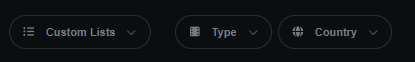
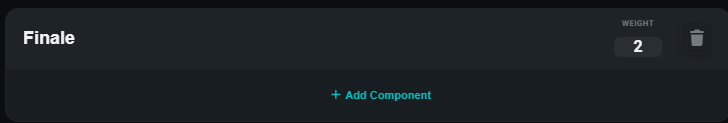
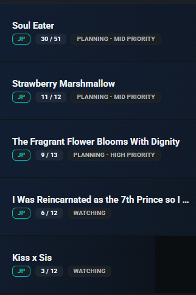

# 🚀 AniList Ultimate - Roadmap & TODO

**Last Updated:** 2026-04-29
**Current Status:** Phase 6 (UI/UX Refinement) 🟢

---

## 🏗️ P6 - UI/UX REFINEMENT (IN PROGRESS)

*Focus: Polishing the interface, fixing layout regressions, and improving transitions.*

### Astra Dashboard & Core UI

- [X] **BUG-020: Resize Handler** - Ensure extension elements (Astra, Tooltips) don't break when resizing the window.

- [/] **Astra Layout Refinement** - Fix elements shifting when the slider appears (Slider should be ignored for width calculations).. Lo slider è ok, ma in base a certi ciriteri la riga si compatta leggeremntte ugualmetne

- [X] **Astra Navigation** - Implement macro-categories (Reading, Completed, All, etc.) as dropdowns or tabs instead of just tags. [RICONTROLLARE]
- [X] **Sticky Search** - Make the search bar in Astra sticky so it stays visible during scroll.
- [ ] **Closing Animation** - Add a smooth "outro" animation when closing the Astra dashboard.
- [X] **Alignment Fix** - Correct decentered items above the votes/scores section.
- [X] **Icon Loading** - Switched to Font Awesome SVG/JS to fix CSP font-blocking issues.

### Page Enhancements (Media & User)

- [X] **Media Page Stability** - Fix social activity bubbles, comments, and filters on individual anime/manga pages (currently broken).
- [ ] **User Activity Enhancements** - Add votes and filters to the single user activity feed.
- [ ] **Banner Action** - Add a "+" button near the "Follow" button in user banners to quickly add/remove from custom lists.
- [ ] **Follower Stats** - Add follower/following counters to relevant profile sections.
- [X] **Missing UI Elements** - Restored the "pill" buttons in the media page sidebar "In Progress" section. [DONE]

### Visual & Assets

- [X] **BUG-021: Comment Icon** - Replace low-res SVG with high-quality version and fix hover trigger area. [DONE]
- [X] **BUG-025: Weight Position** - Move the Global Weight indicator to the left in Astra rows.
- [ ] **COS-002: Calendar Redesign** - Rework the graphics for social activity within the calendar cards.
- [ ] una funzione che permette di unire i commenti scritti dentro le note di astra, quelle nei singoli episodi, e fare append al commenton originale di anilist
- [ ] anche lo slider default di anilist è stato cambiato con quello di astra, no. Analisit deve avere il suo nella home

prime e dopo type e country c è dello spazio indesiderato, che siano in qualche wrap non voluto?

direi che l add component possiamo aggiungerlo direttametne sopra eh, così guadaganmo molto spazio verticalmetne

mettere un altro tag +N, dove quando vai su N esce un popup dicendo tutte le altre liste di cui fa parte, anzi forse meglio farslo subito dopo il numero di ep? tanto lo status verrà tolto cacnellando ol opzione Flat/grouped e lasciando solo grouped

Ovviametne quando si clicca il + su anilist,m deve aggiornarsi anche le ntry su astra dashoboard, stessa cosa vale per ogni volta che su anilist la entry subisce modifiche

---

## 🛠️ P7 - DEBUG & ERRORS

- [ ] **Runtime Fix** - `TypeError: Cannot read properties of undefined (reading 'init')` at `settings#au-custom-lists`.
- [ ] **BUG-034: Logging System** - Fix `src/core/logger.ts` so logs actually appear in the console.
- [X] **API Resilience** - Ensure cached data (Reviews, Calendar) is shown if API is down. [DONE]
- [ ] **Astra Bug Hunt** - Systematic testing of internal Astra logic to catch edge-case crashes.

---

## ✨ P8 - NEW FEATURES & INTEGRATIONS

- [X] **Media Metadata** - Add MAL score, MAL link, and Subreddit link to media pages (with caching and native styling). [DONE]
- [ ] **Watch Section** - Implement a "Watch" section with search links for official and unofficial sites (Intro/Outro support).
- [ ] **Music Integration** - Show Opening/Ending titles with direct YouTube search links.
- [ ] **Bulk Editor** - Create a tool for bulk editing items within custom lists.
- [ ] **Progress Notes** - Show/edit notes immediately when incrementing episode/chapter progress.
- [ ] **Wrapped 2026** - Complete the implementation of the annual summary feature.
- [ ] **Offline Astra** - Research keeping Astra functional (read-only) even without an active API connection.

---

## 🧹 P9 - STABILITY & REFACTORING

- [X] **Social Activity Stabilization** - Restricted social bubbles to home page and ensured cleanup on navigation. [DONE]
- [X] **Home Page Social Bubbles** - Implemented calendar-style floating portals for all home page native cards. [DONE]
  - [!] *Known Bug*: Sometimes bubbles persist on screen (will address later).
- [X] **Brand Cleanup** - Removed legacy "v2" CSS classes, updated project descriptions/logs, and cleaned up storage keys. [DONE]
- [X] **Status Enums** - Replaced hardcoded strings for "Reading", "Watching", "Plan" with a centralized TypeScript Enum for better type safety. [DONE]
- [ ] **Review Caching** - Verify if the main `/reviews` page needs the same caching logic as the homepage.
- [ ] attenzione che il calendario c è ed ok, ma a votla compare anche la sezione airing, ovvero la duplicaizone del calendairo
- [ ] implementare una ricerca multipla, con più liste ad esempio? non so, ci penserò
- [ ] Togliere quel pallino fastidioso che fa da stanghetta alal A nel logo Astra

---

## 📋 CURRENT WORK & PLANS

- [Plan: Social Activity Module Refinement](file:///C:/Users/ricca/.gemini/antigravity/brain/dd7e044c-453b-4dcf-a6ab-189b6a43b3c4/implementation_plan.md)

- [X] **Comment Caching** - Persistent storage for user notes/comments. [DONE]

---

## ✅ ARCHIVE (COMPLETED)

<b>Click to view completed Milestones (P1 - P5)</b>

### P5 - Data Consistency & Astra Stability

- ✅ **BUG-008**: Calendar social avatars always show.
- ✅ **BUG-009**: Astra dashboard initialization race condition fix.
- ✅ **BUG-031**: Works index map sync.
- ✅ **ARCH-003**: Vue.js Router interference prevention (`stopPropagation`).
- ✅ **UI-001**: Layout shift fix (inset box-shadow + scrollbar-gutter).

### P4 - Type Safety

- ✅ **BUG-014/16/17**: Removed `any` from EventBus, Config, and AstraModule.
- ✅ **API Transparency**: Detailed GQL error extraction and 429 Toast warnings.

### P3 - Performance

- ✅ **BUG-007**: SharedGlobalObserver implementation.
- ✅ **BUG-010**: Local Font Awesome bundle.
- ✅ **BUG-011**: Manifest CSS bundling.

### P2 - High Impact

- ✅ **BUG-003/006**: Notification merge/unmerge logic.
- ✅ **BUG-028**: API spam reduction in SocialService.
- ✅ **BUG-033**: Comment cache corruption fix.

### P1 & Caching

- ✅ **Security**: GraphQL injection prevention in SocialService.
- ✅ **Smart Caching**: Implemented fingerprint-based invalidation for Activities, Reviews, Calendar, and Notifications.

<b>Recently Finished UI Tasks (P6)</b>

- ✅ **BUG-018**: Dropdown arrow repetition fix.
- ✅ **BUG-026**: Progress bar color darkened.
- ✅ **BUG-027**: Row width set to 100%.
- ✅ **COS-001**: Title Case for "All Statuses".
- ✅ **COS-003**: Bouncy pop-up animation for Astra.
- ✅ **COS-005**: Default filters set to "All".
- ✅ **Astra Search**: Fixed sticky positioning.
- ✅ **BUG-020**: Resize Handler (Tooltips & Dashboard).
- ✅ **Astra Layout**: Scrollbar-gutter stability.
- ✅ **Astra Navigation**: Macro-categories & Grouped view.

---
