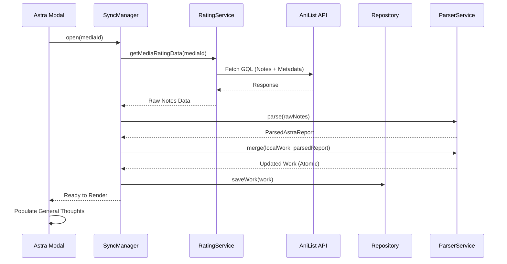
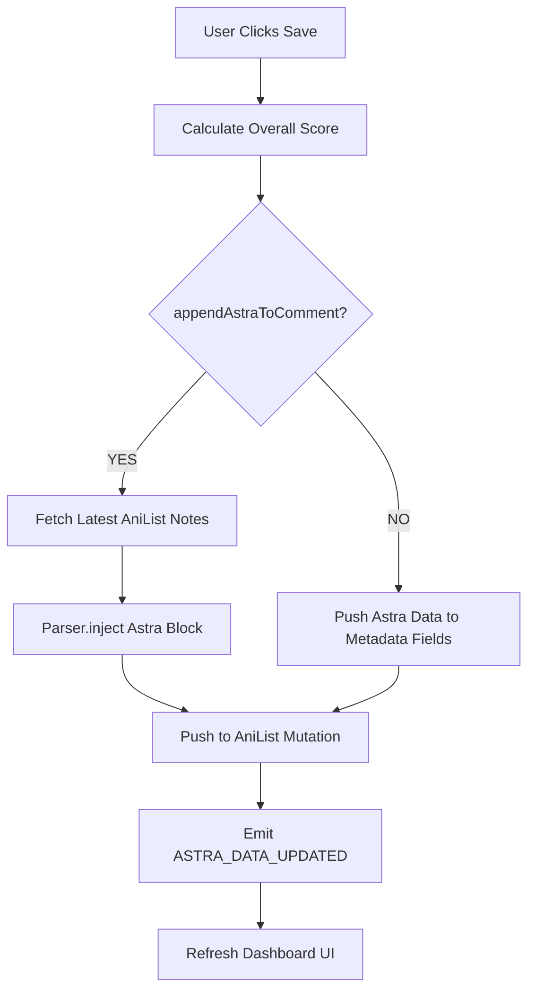
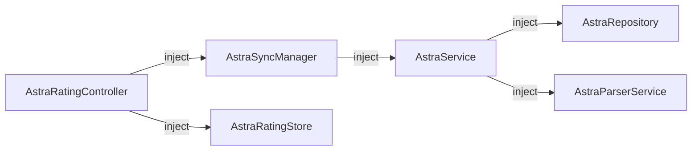
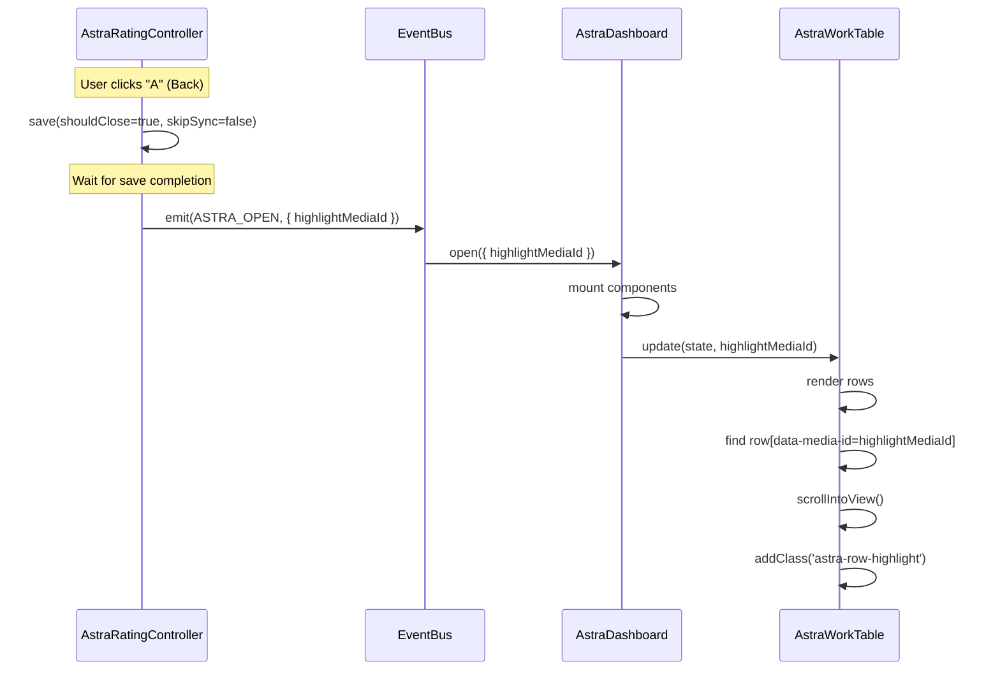

# Astra Module Diagrams

This file serves as a persistent repository for all architectural diagrams related to the Astra module.

## 1. Synchronization Flow (AniList <-> Astra)

This diagram illustrates the "Top-Block-Bottom" decomposition and the JIT (Just-In-Time) pull strategy used when opening the rating modal.

## 2. Save & Sync Pipeline

How Astra ensures that local ratings are safely pushed to AniList without destroying user comments.

## 3. Module Lifecycle & DI

## 4. Modal-to-Dashboard Navigation (Back Flow)

